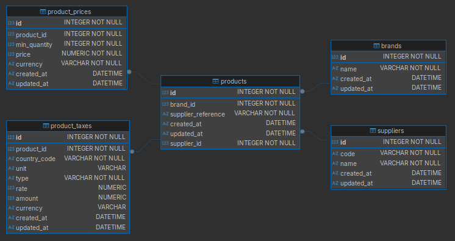
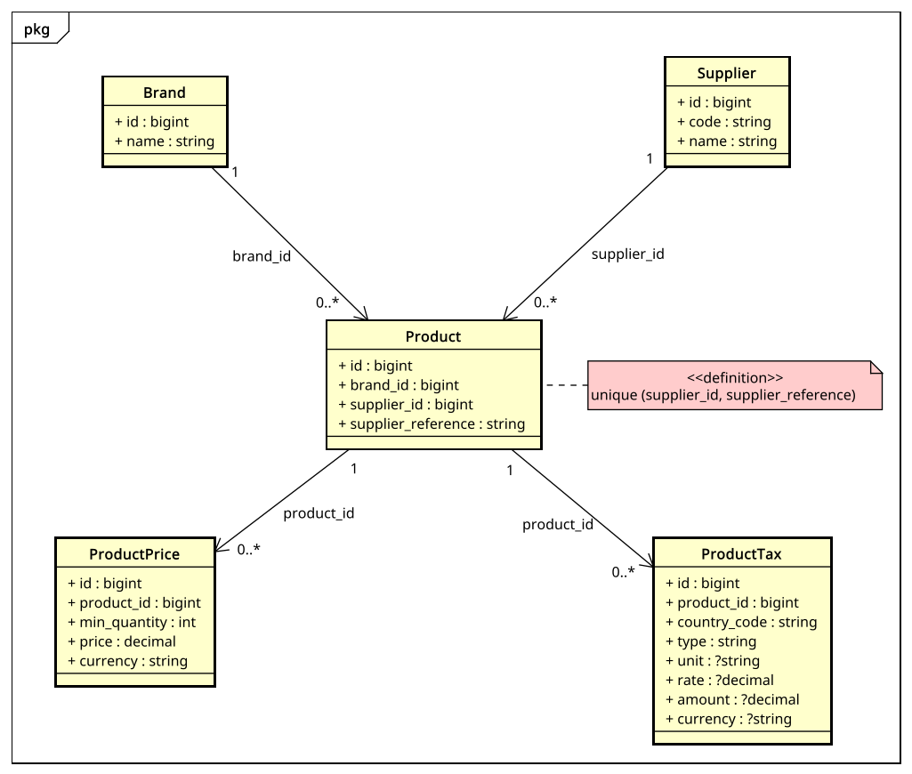

# <center> Tariflex </center>

---
### <center> Importador de tarifas de proveedores </center>

Servicio Laravel que importa tarifas de proveedores en formato Excel (cada proveedor con su propio layout), las normaliza en una base de datos relacional y expone una API JSON para consultar el catálogo resultante.

> **Stack:** PHP 8.4 · Laravel 13 · SQLite · PhpSpreadsheet · PHPUnit · Pint.

---

## Setup

Pre-requisitos: PHP 8.4, Composer 2, extensión `sqlite3`.

```bash
git clone <repo>
cd tariflex
composer install
cp .env.example .env
php artisan key:generate
touch database/database.sqlite
php artisan migrate
php artisan db:seed
php artisan serve
```

Por defecto la app escucha en `http://127.0.0.1:8000`.

### Tests

```bash
php artisan test
```

Los tests usan SQLite `:memory:` (configurado en `phpunit.xml`).

---

## Cómo importar y consultar

### Importar un archivo de tarifa

`POST /api/imports` (multipart):

```bash
curl -X POST http://127.0.0.1:8000/api/imports \
  -H "Accept: application/json" \
  -F "supplier_code=acme" \
  -F "file=@tests/Fixtures/Excels/acme.xlsx"
```

`db:seed` deja las filas de `suppliers` para `acme` y `globaltech`. Si agregás un nuevo proveedor en `config/importing.php`, agregalo también a `database/seeders/SupplierSeeder.php` (o creá la fila a mano en `suppliers`).

Respuesta:

```json
{
  "created": 3,
  "updated": 0,
  "errors": []
}
```

Re-ejecutar el mismo archivo es idempotente: los productos existentes pasan a `updated`. Los errores por fila (formato inválido, columna faltante, etc.) se devuelven en `errors[]` con la fila donde ocurrieron, sin abortar el resto del batch.

Códigos de proveedor disponibles (registrados en `config/importing.php`):

- `acme` — formato hoja única, columnas en español, precios y impuestos en columnas.
- `globaltech` — formato multi-hoja (`Products` / `Pricing` / `Taxes`), inglés, precios e impuestos en formato largo.

### Consultar productos

`GET /api/products` — devuelve productos paginados con sus precios y impuestos.

```bash
curl "http://127.0.0.1:8000/api/products?brand=Acme&reference=A-001"
```

Filtros soportados:

- `brand` — coincidencia exacta del nombre de marca.
- `reference` — coincidencia exacta de `supplier_reference`.
- `per_page` — tamaño de página (paginador estándar de Laravel).

---

## Modelo de datos

 

- `products` tiene índice único `(supplier_id, supplier_reference)`, la clave de upsert al re-importar.
- `product_prices` modela tramos por cantidad mínima (1u, 10u, 50u…).
- `product_taxes` usa un discriminador `type` (`'percentage'` o `'fixed'`); `rate` y `amount` son nullables y mutuamente excluyentes según ese tipo.

---

## Diagrama de clases



Las cinco entidades de dominio (`Brand`, `Supplier`, `Product`, `ProductPrice`, `ProductTax`) con sus atributos, foreign keys y cardinalidades. La nota sobre `Product` marca la constraint única `(supplier_id, supplier_reference)` que sostiene el upsert idempotente al re-importar.

---

## Decisiones de diseño

- **Service Layer + Strategy/Registry/DTO.** `Controller → Service → Eloquent`. El importador agrega Strategy (un parser por proveedor) + Registry (`config/importing.php`) + DTO (`ImportedProductDTO`). Los detalles del Excel nunca se filtran a la capa de persistencia.
- **Tablas normalizadas para precios e impuestos** (no JSON). La cardinalidad variable y la necesidad eventual de filtrar/indexar por país o tramo lo justifican.
- **Upsert por `(supplier_id, supplier_reference)`.** Re-importar el mismo archivo es idempotente.
- **Transacción por producto y no por archivo.** Una fila mala no invalida el batch: los errores se acumulan en `ImportSummary.errors` con número de fila.
- **Identificación manual del proveedor.** El usuario elige `supplier_code` al subir el archivo.
- **Importación síncrona.** Suficiente para el alcance.
- **Sobrescritura de precios/impuestos al re-importar.** Sin pricing histórico.
- **SQLite.** Simplicidad. El esquema es portable a MySQL/Postgres sin cambios estructurales.

---

## Alternativas consideradas y descartadas

| Alternativa | Por qué no                                                                                                                 |
|---|----------------------------------------------------------------------------------------------------------------------------|
| **MySQL / PostgreSQL** | SQLite ya se usa en las pruebas, considerado un overkill. Eventualmente, el modelo puede migrar sin cambios estructurales. |
| **maatwebsite/excel** | Conflictos con Strategy por proveedor. PhpSpreadsheet directo encaja mejor.                                                |

---

## Cómo agregar un nuevo proveedor

Dos pasos:

1. Crear una clase `App\Importing\Parsers\NuevoProveedorParser` que implemente `App\Importing\Contracts\SupplierParser` y haga `yield ImportedProductDTO` por cada producto.
2. Registrar la nueva clase en `config/importing.php`:

```php
'parsers' => [
    'acme' => AcmeParser::class,
    'globaltech' => GlobalTechParser::class,
    'nuevo' => NuevoProveedorParser::class,
],
```

El nombre se valida automáticamente en `StoreImportRequest`. No hay que tocar controladores, servicios ni migraciones.

Para errores friendly al usuario, se puede lanzar `App\Importing\Exceptions\ParseException` con mensaje y, si aplica, `row: $rowIndex`. El servicio los toma en `ImportSummary.errors`.

---

## Qué testeé y qué dejé afuera

**Testeado** (30 tests, todos PHPUnit):

- `GET /api/products`: lista vacía, filtros (`brand`, `reference`), paginación, payload con precios e impuestos.
- `POST /api/imports`: happy path con fixture mínima, validación (`supplier_code` desconocido, `file` ausente, extensión incorrecta), manejo de errores (xlsx malformado, headers requeridos faltantes, valores no numéricos, country code inválido).
- `ImportService`: creación, idempotencia en re-import, aislamiento de errores por DTO mediante `DB::transaction`.
- `ParserRegistry`: resolución y `ParserNotFoundException`.
- Parsers `AcmeParser` y `GlobalTechParser`: parseo end-to-end de las fixtures con DTOs esperados, fila mínima con campos opcionales en null, errores friendly.
- Tests de integración HTTP que prueban la abstracción del DTO ejecutando dos formatos estructuralmente distintos por el mismo pipeline.

**Fuera de alcance** (intencionalmente):

- Auth, usuarios.
- UI / Blade. Solo API JSON.
- Auto detección del proveedor por headers del archivo.
- Imports asincrónicos / queues.
- CSV (Se limitó a Excel).

---

## Supuestos

- **Currency es por fila de precio.** El modelo no fuerza una sola moneda por proveedor; en la práctica se asume que cada proveedor usa una.
- **Country codes** siguen ISO 3166-1 alpha-2 (`UY`, `ES`, `US`). El parser de GlobalTech valida el formato y rechaza valores fuera de ese patrón.
- **Tax type** es discriminador string (`'percentage'` o `'fixed'`), validado en PHP. Se prefiere a un ENUM nativo por portabilidad entre motores SQL.
- **Units** acepta texto libre, normalizadas a minúsculas. Valores comunes: `unit`, `kg`, `l`, `m`.
- **Re-import = overwrite** de `product_prices` y `product_taxes` para el producto afectado. No se conserva historial.

---

## ¿Qué mejoraría?

- **Importación asincrónica** con Laravel Jobs y queues para archivos grandes.
- **Migración a MySQL/Postgres** si crece el dataset.
- **Lista cerrada de country codes** validada contra la tabla ISO completa (hoy solo se valida formato `[A-Z]{2}`).
